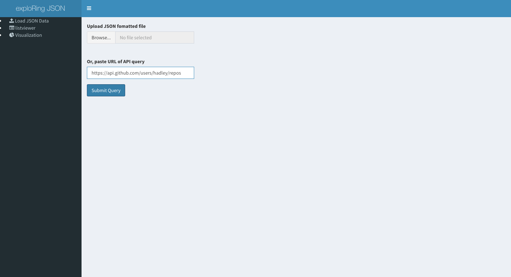
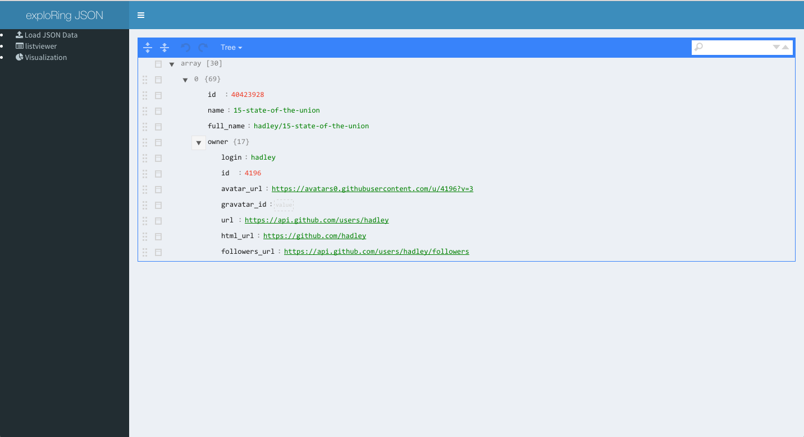
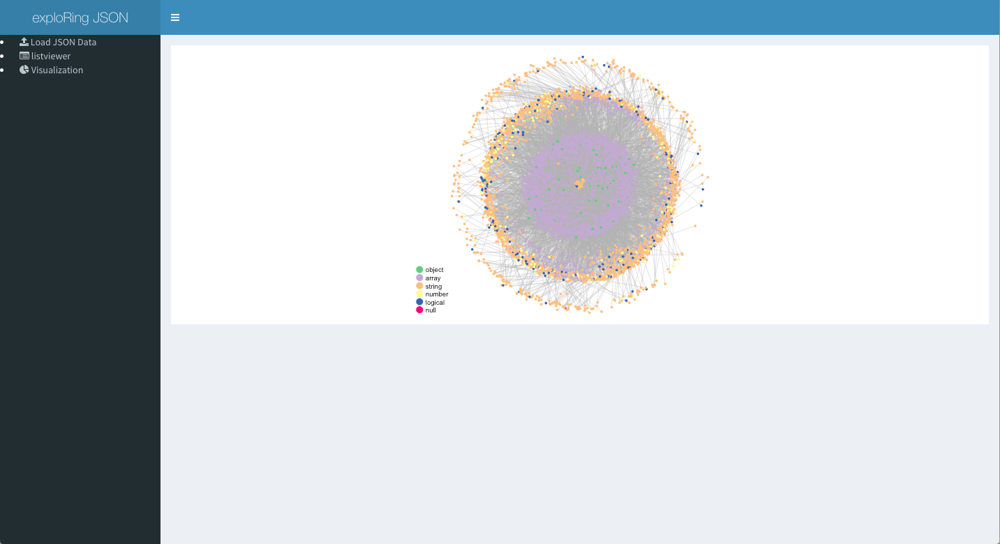

README
================

Survey of JSON Affiliated R Packages
====================================

Need a package to help parse or explore the organization of keys within JSON that might be messy, complex, large, or **unknown**

### Conversion/Processing

-   [jsonlite](https://www.opencpu.org/posts/jsonlite-a-smarter-json-encoder)
-   [tidyjson](https://github.com/sailthru/tidyjson)
-   [rjson](https://mran.microsoft.com/web/packages/rjson/rjson.pdf)
-   [rjsonio](https://mran.microsoft.com/web/packages/RJSONIO/RJSONIO.pdf)
-   [df2json](http://github.com/nachocab/df2json)
-   [jqr](https://github.com/ropensci/jqr)
-   [ndjson](http://gitlab.com/hrbrmstr/ndjson)

### API Consumer

-   [rjsonapi](https://github.com/ropensci/rjsonapi)

### Schema Validation

-   [ajv](https://github.com/jdthorpe/ajvr)
-   [geojsonlint](https://github.com/ropenscilabs/geojsonlint)
-   [jsonvalidate](https://github.com/ropenscilabs/jsonvalidate)
-   [validatejsonr](https://mran.microsoft.com/web/packages/validatejsonr/validatejsonr.pdf)

### Configuration Files

-   [configr](https://github.com/Miachol/configr)

### GeoJSON

-   [geojson](https://github.com/ropensci/geojson)
-   [geojsonio](https://github.com/ropensci/geojsonio)
-   [geojsonlint](https://github.com/ropenscilabs/geojsonlint)
-   [geojsonR](https://github.com/mlampros/geojsonR)
-   [randgeo](https://github.com/ropensci/randgeo)
-   [rmapshaper](https://github.com/ateucher/rmapshaper)
-   [wellknown](https://github.com/ropensci/wellknown)

### Mapping

-   [leaflet](http://rstudio.github.io/leaflet/)
-   [leafletCN](https://mran.microsoft.com/web/packages/leafletCN/leafletCN.pdf)

### Helpers

-   [listviewer (htmlwidget for interactive views of R lists)](https://github.com/timelyportfolio/listviewer)

### Other

-   [jsonId (linking data)](https://github.com/ropensci/jsonld#readme)
-   [repijson (epidemiology data)](https://mran.microsoft.com/web/packages/repijson/repijson.pdf)
-   [rjstat (JSON-stat data)](https://github.com/ajschumacher/rjstat)
-   [rtson (typed JSON)](https://github.com/tercen/TSON)

package `JSOmetaN`
================

-   Available at [sctyner/JSOmetaN](https://github.com/sctyner/JSOmetaN)
-   provides high level meta data for JSON
-   useful if you're not sure what the object structure is
-   uses two functions: fetch and dig
-   iteratively give information about nested key value relationships

### fetch

provides meta information:
- key names
- number of documents with those keys
- whether the key is terminal or contains further nested structure


### dig

subsets the data by a specific keyname, dropping down a level in organization


------------------------------------------------------------------------

``` r
devtools::install_github("sctyner/JSOmetaN")
library(jsonlite)
library(JSOmetaN)
data1 <- fromJSON("https://api.github.com/users/hadley/repos")
data1 %>% fetch() %>% dig("owner") %>% fetch()
```

    ## # A tibble: 69 x 5
    ##            Key Doc.count      Class Obj.len Is.terminal
    ##          <chr>     <dbl>      <chr>   <dbl>       <lgl>
    ##  1          id        30    integer       1        TRUE
    ##  2        name        30  character       1        TRUE
    ##  3   full_name        30  character       1        TRUE
    ##  4       owner        30 data.frame      17       FALSE
    ##  5     private        30    logical       1        TRUE
    ##  6    html_url        30  character       1        TRUE
    ##  7 description        27  character       1        TRUE
    ##  8        fork        30    logical       1        TRUE
    ##  9         url        30  character       1        TRUE
    ## 10   forks_url        30  character       1        TRUE
    ## # ... with 59 more rows
    ## # A tibble: 17 x 5
    ##                    Key Doc.count     Class Obj.len Is.terminal
    ##                  <chr>     <dbl>     <chr>   <dbl>       <lgl>
    ##  1               login        30 character       1        TRUE
    ##  2                  id        30   integer       1        TRUE
    ##  3          avatar_url        30 character       1        TRUE
    ##  4         gravatar_id        30 character       1        TRUE
    ##  5                 url        30 character       1        TRUE
    ##  6            html_url        30 character       1        TRUE
    ##  7       followers_url        30 character       1        TRUE
    ##  8       following_url        30 character       1        TRUE
    ##  9           gists_url        30 character       1        TRUE
    ## 10         starred_url        30 character       1        TRUE
    ## 11   subscriptions_url        30 character       1        TRUE
    ## 12   organizations_url        30 character       1        TRUE
    ## 13           repos_url        30 character       1        TRUE
    ## 14          events_url        30 character       1        TRUE
    ## 15 received_events_url        30 character       1        TRUE
    ## 16                type        30 character       1        TRUE
    ## 17          site_admin        30   logical       1        TRUE

Shiny App: exploRing JSON
=========================

-   App for exploring JSON array data
-   Can upload a file in `.json` format
-   Or, can provide a query to an API

Functionality right now
-----------------------

1.  First, upload/query your JSON array data
2.  Explore it with [`listviewer`](https://github.com/timelyportfolio/listviewer)
3.  View the structure of the data as a node-link diagram [(code for plot taken from here)](https://github.com/jeremystan/tidyjson/blob/master/vignettes/visualizing-json.Rmd#visualizing-as-graphs)

Appearance
----------

Uploading file



Using `listviewer::jsonedit()`



View data as node-link diagram


